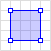

# Simple Features

[](https://pkg.go.dev/github.com/peterstace/simplefeatures/geom?tab=doc)
[](https://github.com/peterstace/simplefeatures/actions)
[](https://goreportcard.com/report/github.com/peterstace/simplefeatures)

Simple Features is a 2D geometry library. It provides Go types that model
geometries, as well as algorithms that operate on them.

Simple Features is a pure Go Implementation of the OpenGIS Consortium's Simple
Feature Access Specification (which can be found
[here](http://www.opengeospatial.org/standards/sfa)). This is the same
specification that [GEOS](https://trac.osgeo.org/geos),
[JTS](https://locationtech.github.io/jts/), and [PostGIS](https://postgis.net/)
implement, so the Simple Features API will be familiar to developers who have
used those libraries before.

### Geometry Types

<table>

<thead>
<tr>
<th>Type</th>
<th>Example</th>
<th>Description</th>
</tr>
</thead>

<tr>
<td><a href="https://pkg.go.dev/github.com/peterstace/simplefeatures/geom#Point">Point</a></td>
<td><a href="https://commons.wikimedia.org/wiki/File:SFA_Point.svg"></a></td>
<td>Point is a single location in space.</td>
</tr>

<tr>
<td><a href="https://pkg.go.dev/github.com/peterstace/simplefeatures/geom#MultiPoint">MultiPoint</a></td>
<td><a href="https://commons.wikimedia.org/wiki/File:SFA_MultiPoint.svg"></a></td>
<td>MultiPoint is collection of points in space.</td>
</tr>

<tr>
<td><a href="https://pkg.go.dev/github.com/peterstace/simplefeatures/geom#LineString">LineString</a></td>
<td><a href="https://commons.wikimedia.org/wiki/File:SFA_LineString.svg"></a></td>
<td>LineString is curve defined by linear interpolation between a set of
control points.</td>
</tr>

<tr>
<td><a href="https://pkg.go.dev/github.com/peterstace/simplefeatures/geom#MultiLineString">MultiLineString</a></td>
<td><a href="https://commons.wikimedia.org/wiki/File:SFA_MultiLineString.svg"></a></td>
<td>MultiLineString is a collection of LineStrings.</td>
</tr>

<tr>
<td><a href="https://pkg.go.dev/github.com/peterstace/simplefeatures/geom#Polygon">Polygon</a></td>
<td><a href="https://commons.wikimedia.org/wiki/File:SFA_Polygon.svg"></a></td>
<td>Polygon is a planar surface geometry that bounds some area. It may have holes.</td>
</tr>

<tr>
<td><a href="https://pkg.go.dev/github.com/peterstace/simplefeatures/geom#MultiPolygon">MultiPolygon</a></td>
<td><a href="https://commons.wikimedia.org/wiki/File:SFA_MultiPolygon.svg"></a></td>
<td>Polygon is collection of Polygons (with some constraints on how the Polygons interact with each other).</td>
</tr>

<tr>
<td><a href="https://pkg.go.dev/github.com/peterstace/simplefeatures/geom#GeometryCollection">GeometryCollection</a></td>
<td><a href="https://commons.wikimedia.org/wiki/File:SFA_GeometryCollection.svg"></a></td>
<td>GeometryCollection is an unconstrained collection of geometries.</td>
</tr>

<tr>
<td><a href="https://pkg.go.dev/github.com/peterstace/simplefeatures/geom#Geometry">Geometry</a></td>
<td><a href="https://commons.wikimedia.org/wiki/File:SFA_Polygon.svg"></a></td>
<td>Geometry holds any type of geometry (Point, MultiPoint, LineString, MultiLineString, Polygon, MultiPolygon, or GeometryCollection). It's the type that the Simple Features library uses when it needs to represent geometries in a generic way.</td>
</tr>

<tr>
<td><a href="https://pkg.go.dev/github.com/peterstace/simplefeatures/geom#Envelope">Envelope</a></td>
<td></td>
<td>Envelope is an axis aligned bounding box typically used to describe the spatial extent of other geometric entities.</td>
</tr>

</table>

### Marshalling and Unmarshalling

Simple features supports the following external geometry representation formats:

| Format  | Example                                                              | Description                                                      |
| ---     | ---                                                                  | ---                                                              |
| WKT     | `POLYGON((0 0,0 1,1 1,1 0,0 0))`                                     | Well Known Text. A human readable format for storing geometries. |
| WKB     | `<binary>`                                                           | Well Known Binary. A fast and efficient machine readable format. |
| GeoJSON | `{"type":"Polygon","coordinates":[[[0,0],[0,1],[1,1],[1,0],[0,0]]]}` | GeoJSON. A web-friendly format.                                  |

#### WKT

[Well Known
Text](https://en.wikipedia.org/wiki/Well-known_text_representation_of_geometry)
is the lowest common denominator geometry representation format. It's a useful
default format to choose when integrating with external GIS systems.

Example:

```
// Unmarshal from WKT
input := "POLYGON((0 0,0 1,1 1,1 0,0 0))"
g, err := geom.UnmarshalWKT(input)
if err != nil {
    log.Fatal("could not unmarshal WKT: %v", err)
}

// Marshal to WKT
output := g.AsText()
fmt.Println(output)
```

#### WKB

TODO: Examples for each.

#### GeoJSON

TODO: Examples for each.

### Geometry Algorithms

TODO

### GEOS Wrapper

A [GEOS](https://www.osgeo.org/projects/geos/) CGO wrapper is also provided,
giving access to functionality not yet implemented natively in Go. The [wrapper
is implemented in a separate
package](https://pkg.go.dev/github.com/peterstace/simplefeatures/geos?tab=doc),
meaning that library users who don't need this additional functionality don't
need to expose themselves to CGO.

### FAQs

**Q:** Why create Simple Features when the GEOS library already exists?

**A:** TODO
