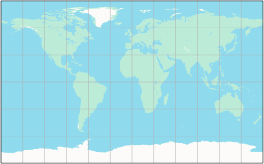
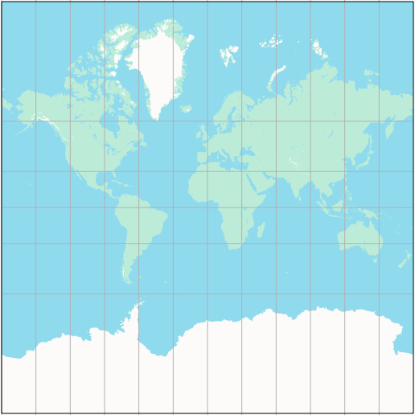
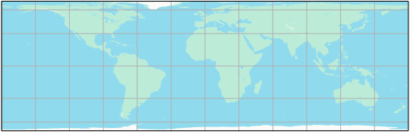
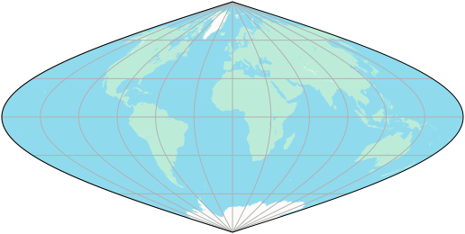
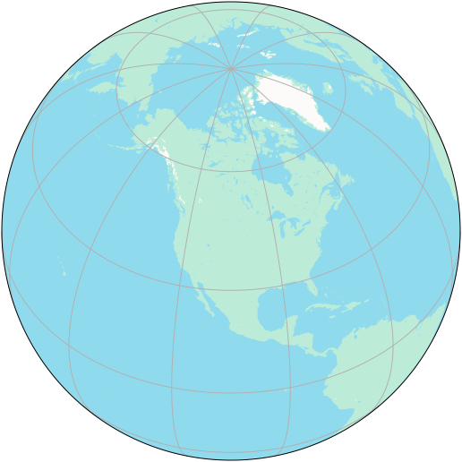
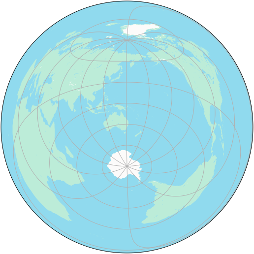
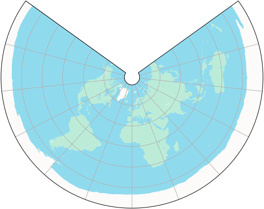
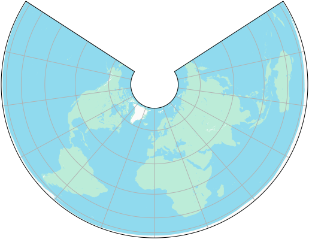
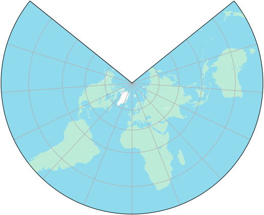

# `carto` package

Package carto provides cartography functionality for working with and making
maps.

This includes:

  - Various projections between angular coordinates (longitude and latitude)
    and planar coordinates (x and y).

  - Earth radius definitions.

See
[godoc](https://pkg.go.dev/github.com/peterstace/simplefeatures/carto?tab=doc)
for the full package documentation.

---

The following section shows supported projections. The code used to generate
the images in this section can be found
[here](https://github.com/peterstace/simplefeatures/tree/master/internal/cartodemo).

[**Equirectangular projection**](https://en.wikipedia.org/wiki/Equirectangular_projection)

Standard parallels are set to 36°N and 36°S. This configuration of the
Equirectangular projection is also known as the Marinus (of Tyre) projection.

[**Web Mercator projection**](https://en.wikipedia.org/wiki/Web_Mercator_projection)

This is the full zoom 0 tile of the Web Mercator projection.

[**Lambert Cylindrical Equal Area projection**](https://en.wikipedia.org/wiki/Lambert_cylindrical_equal-area_projection)

The central meridian is set to 0°E.

[**Sinusoidal projection**](https://en.wikipedia.org/wiki/Sinusoidal_projection)

The central meridian is set to 0°E.

[**Orthographic projection**](https://en.wikipedia.org/wiki/Orthographic_projection)

Centered on North America at 45°N, 105°W.

[**Azimuthal Equidistant projection**](https://en.wikipedia.org/wiki/Azimuthal_equidistant_projection)

Centered at Sydney, Australia at 151°E, 34°S.

[**Equidistant Conic projection**](https://en.wikipedia.org/wiki/Equidistant_conic_projection)

Standard parallels are set to 30°N and 60°N. The central meridian is set to
0°E.

[**Albers Equal Area Conic projection**](https://en.wikipedia.org/wiki/Albers_projection)

Standard parallels are set to 30°N and 60°N. The central meridian is set to
0°E.

[**Lambert Conformal Conic projection**](https://en.wikipedia.org/wiki/Lambert_conformal_conic_projection)

Standard parallels are set to 30°N and 60°N. The central meridian is set to
0°E.

